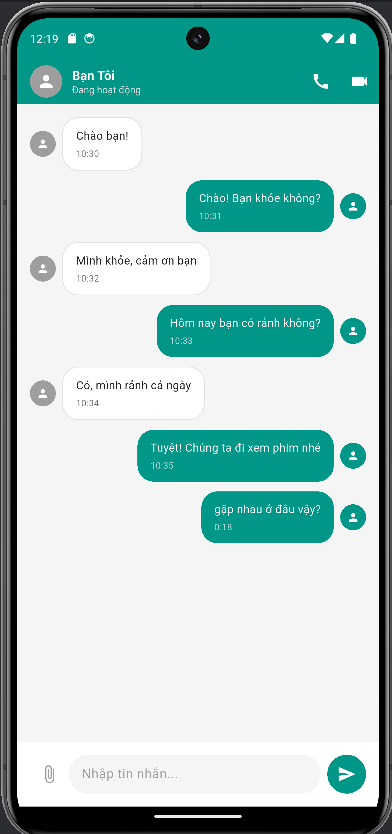

# Chat UI Clone App - Flutter

Một ứng dụng giao diện chat được xây dựng bằng Flutter, mô phỏng giao diện trò chuyện trực tuyến với thiết kế Material Design hiện đại và tính năng nhắn tin thời gian thực.

### Screenshots



## Chức năng chính

- **Giao diện chat** với tin nhắn theo thời gian thực
- **Phân biệt tin nhắn** giữa người gửi và người nhận

## Công nghệ & Kỹ thuật

### **Framework & Language**
- **Flutter** - Cross-platform development framework
- **Dart** - Programming language

### **State Management**
- **StatefulWidget** - Local state management
- **setState()** - Simple state updates

### **Data Storage**
- **Local State Management** - In-memory message storage
- **Message Model** - Simple data structure for chat messages
- **List<Message>** - Dynamic message collection

### **UI Components**
- **Material Design 3** - Modern design system
- **ListView.builder** - Efficient scrollable chat messages
- **Row** - Horizontal layout for message elements and input field
- **Column** - Vertical layout for screen structure and message content
- **Container** - Custom styling and positioning for message bubbles
- **TextField** - Message input field

## Cài đặt và Chạy

### **Yêu cầu hệ thống**
- Flutter SDK (3.9.2 hoặc mới hơn)
- Dart SDK

### **1. Clone repository**
```bash
cd chatUI_clone_app
```

### **2. Cài đặt dependencies**
```bash
flutter pub get
```

### **3. Chạy ứng dụng**

#### **Trên Android Emulator:**
```bash
# Khởi động emulator
flutter emulators --launch <emulator_id>

# Chạy app
flutter run
```

#### **Trên Web Browser:**
```bash
flutter run -d chrome
```

#### **Build cho production:**
```bash
# Android APK
flutter build apk

# Web
flutter build web

# iOS (trên macOS)
flutter build ios
```

### **4. Development workflow**
```bash
# Chạy với hot reload
flutter run

# Trong terminal flutter run:
# r - Hot reload
# R - Hot restart  
# q - Quit

# Kiểm tra lỗi
flutter analyze

# Chạy tests
flutter test
```