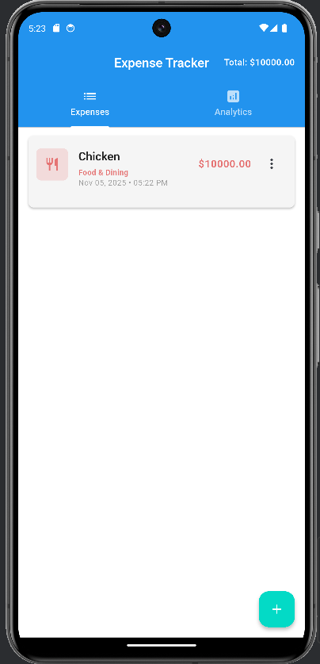
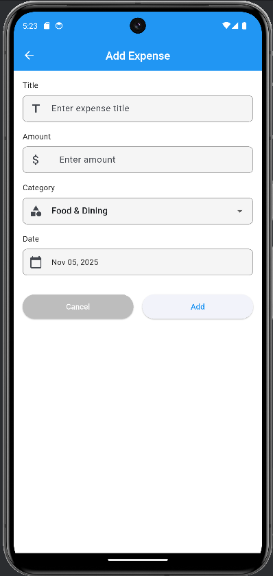
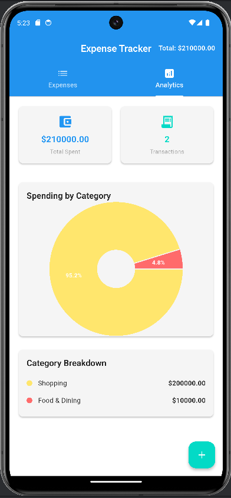

# Expense Tracker App - Flutter

Một ứng dụng quản lý chi tiêu toàn diện được xây dựng bằng Flutter với lưu trữ dữ liệu local offline sử dụng Hive, biểu đồ tương tác với fl_chart, và giao diện responsive.

### Screenshots





## Chức năng chính

- **Thêm chi tiêu mới** với tiêu đề, số tiền, ngày tháng và danh mục
- **Chỉnh sửa chi tiêu** hiện có với validation form
- **Xóa chi tiêu** với xác nhận
- **Xem biểu đồ** phân tích chi tiêu theo danh mục và thời gian
- **Lưu trữ offline** hoàn toàn với Hive database
- **Tìm kiếm và lọc** chi tiêu theo tiêu chí
- **Thống kê tổng quan** theo ngày, tuần, tháng

## Công nghệ & Kỹ thuật

### **Framework & Language**
- **Flutter** - Cross-platform development framework
- **Dart** - Programming language
- **Material Design** - Google design system

### **State Management**
- **Provider** - State management solution
- **ChangeNotifier** - Observable pattern implementation
- **Consumer** - Widget để listen state changes

### **Database & Storage**
- **Hive** - Fast, lightweight NoSQL database
- **Hive Flutter** - Flutter integration
- **Type Adapters** - Object serialization
- **Local Storage** - Offline-first approach

### **Data Visualization**
- **fl_chart** - Interactive charts library
- **Pie Charts** - Category breakdown
- **Line Charts** - Expense trends over time
- **Bar Charts** - Monthly/weekly comparisons

### **UI Components**
- **Card** - Content containers cho expense items
- **ListView** - Scrollable expense list
- **FloatingActionButton** - Add new expense
- **AppBar** - Navigation với actions
- **TextField/TextFormField** - Input với validation
- **DatePicker** - Date selection
- **DropdownButton** - Category selection
- **BottomSheet** - Add/edit expense modal

### **Utilities & Helpers**
- **intl** - Date và currency formatting
- **uuid** - Unique ID generation
- **Form Validation** - Input validation logic

### **Architecture**
- **Model-View-Provider (MVP)** pattern
- **Separation of Concerns** - Models, Providers, Screens, Widgets, Theme
- **Repository Pattern** - Data access abstraction
- **Clean Code** principles

## Cài đặt và Chạy

### **Yêu cầu hệ thống**
- Flutter SDK (3.9.2 hoặc mới hơn)
- Dart SDK (3.9.2 hoặc mới hơn)
- Android Studio / VS Code
- Android Emulator hoặc thiết bị Android
- Web browser (Chrome/Edge) cho web development

### **1. Clone repository**
```bash
cd expense_tracker_app
```

### **2. Cài đặt dependencies**
```bash
flutter pub get
```

### **3. Generate Hive adapters**
```bash
flutter packages pub run build_runner build
```

### **4. Kiểm tra code quality**
```bash
# Analyze code
flutter analyze

# Run tests
flutter test
```

### **5. Chạy ứng dụng**

#### **Trên Android Emulator:**
```bash
# Khởi động emulator
flutter emulators --launch <emulator_id>

# Chạy app với debug mode
flutter run --debug
```

#### **Trên Web Browser:**
```bash
flutter run -d chrome
```

#### **Build cho production:**
```bash
# Android APK
flutter build apk --release

# Web
flutter build web --release

# iOS (trên macOS)
flutter build ios --release
```

### **6. Development workflow**
```bash
# Chạy với hot reload
flutter run

# Trong terminal flutter run:
# r - Hot reload
# R - Hot restart
# q - Quit

# Build runner watch mode (cho Hive adapters)
flutter packages pub run build_runner watch
```