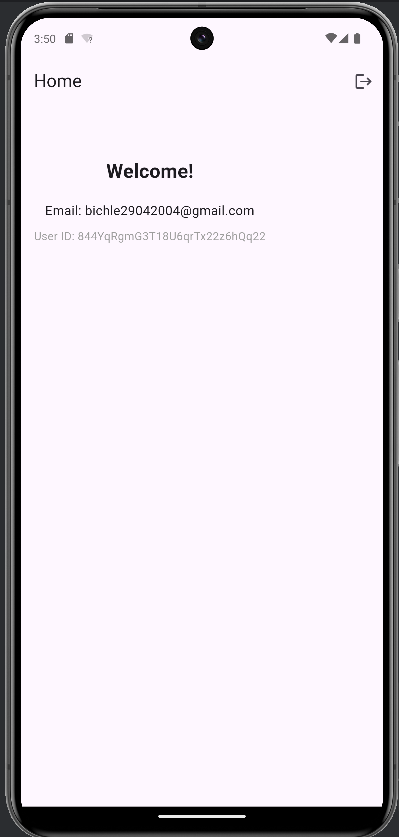
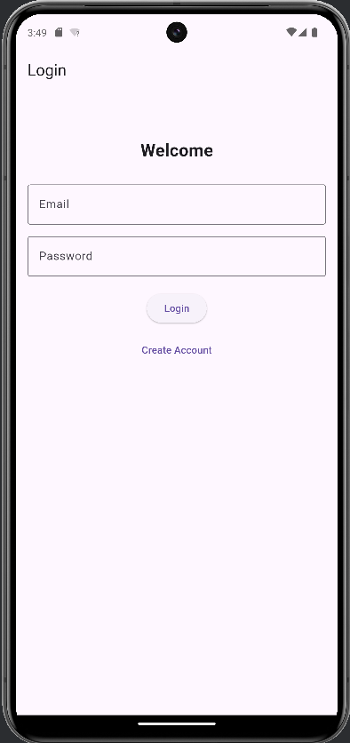

# Firebase Login App - Flutter

Một ứng dụng đăng nhập hiện đại và đơn giản được xây dựng bằng Flutter với Firebase Authentication, giao diện Material Design.

## Demo

### Screenshots





## Chức năng chính

- **Đăng nhập tài khoản** với email và mật khẩu
- **Tạo tài khoản mới** với xác thực email
- **Thông báo lỗi** chi tiết cho các trường hợp nhập sai
- **Tự động đăng nhập** khi đã có phiên làm việc
- **Đăng xuất** dễ dàng từ màn hình chính

## Công nghệ & Kỹ thuật

### **Framework & Language**
- **Flutter** - Cross-platform development framework
- **Dart** - Programming language
- **Material Design** - Google design system

### **Authentication System**
- **Firebase Auth** - Google authentication service
- **firebase_core** - Firebase core functionality
- **Email/Password** - Firebase email authentication
- **User Management** - Firebase user state handling

### **State Management**
- **StreamBuilder** - Firebase auth state listener
- **StatefulWidget** - Local component state
- **TextEditingController** - Input field management
- **Navigator** - Screen navigation handling

### **UI Components**
- **Scaffold** - Basic screen structure
- **AppBar** - Top navigation bar
- **TextField** - Input fields với validation
- **ElevatedButton** - Primary action buttons
- **TextButton** - Secondary action buttons
- **SnackBar** - Toast notification messages
- **CircularProgressIndicator** - Loading indicator

### **Utilities & Helpers**
- **Form Validation** - Input validation logic
- **Error Handling** - Firebase error message processing
- **Screen Navigation** - Route management

## Cài đặt và Chạy

### **Yêu cầu hệ thống**
- Flutter SDK (3.9.2 hoặc mới hơn)
- Dart SDK (3.9.2 hoặc mới hơn)
- Android Studio / VS Code

### **1. Navigate to project**
```bash
cd firebase_login_app
```

### **2. Cấu hình Firebase**
## 1️⃣ Tạo Firebase Project & bật Email/Password Authentication
1. Truy cập [Firebase Console](https://console.firebase.google.com/).
2. Click **Add project** → đặt tên project (ví dụ: `login-app-flutter`) → tạo project.
3. Vào **Authentication** → **Sign-in method** → bật **Email/Password**.

## 2️⃣ Cài FlutterFire CLI
```bash
dart pub global activate flutterfire_cli
```
Nếu terminal báo "flutterfire: command not found", thêm vào PATH:
```bash
export PATH="$PATH:$HOME/.pub-cache/bin"
```

## 3️⃣ Cấu hình project Flutter với Firebase

Đảm bảo file `lib/firebase_options.dart` đã được tạo bằng FlutterFire CLI:
```bash
# Đăng nhập Firebase
firebase login

# Cấu hình project
flutterfire configure --project=your-firebase-project-id
```


### **3. Cài đặt dependencies**
```bash
flutter pub get
```

### **4. Kiểm tra code quality**
```bash
# Analyze code
flutter analyze

# Run tests
flutter test
```

### **5. Chạy ứng dụng**

#### **Trên Android Emulator:**
```bash
# Khởi động emulator
flutter emulators --launch <emulator_id>

# Chạy app với debug mode
flutter run --debug
```

#### **Trên Web Browser:**
```bash
flutter run -d chrome
```

#### **Build cho production:**
```bash
# Android APK
flutter build apk --release

# Web
flutter build web --release

# iOS (trên macOS)
flutter build ios --release
```

### **6. Development workflow**
```bash
# Chạy với hot reload
flutter run

# Trong terminal flutter run:
# r - Hot reload
# R - Hot restart
# q - Quit
```