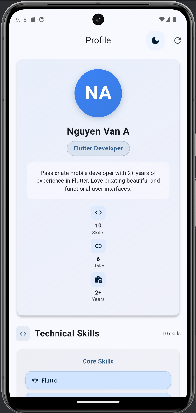
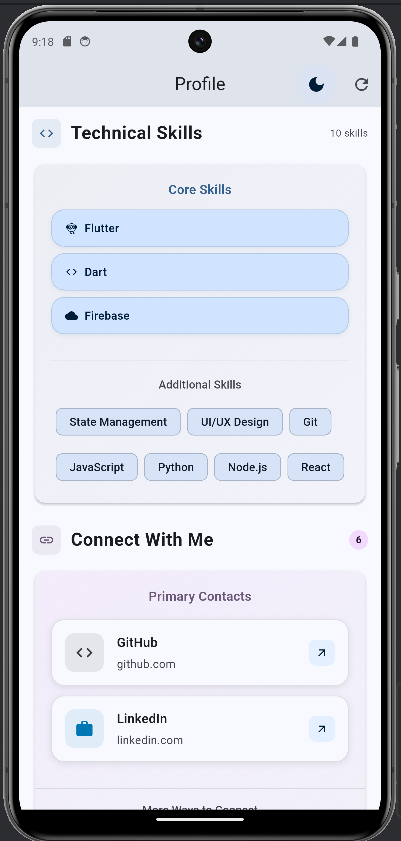
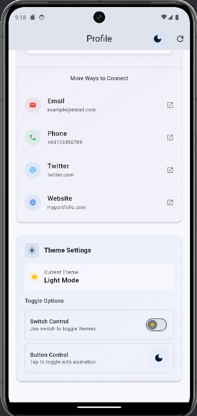
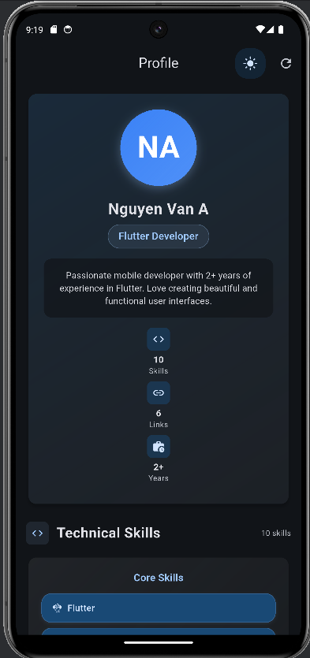
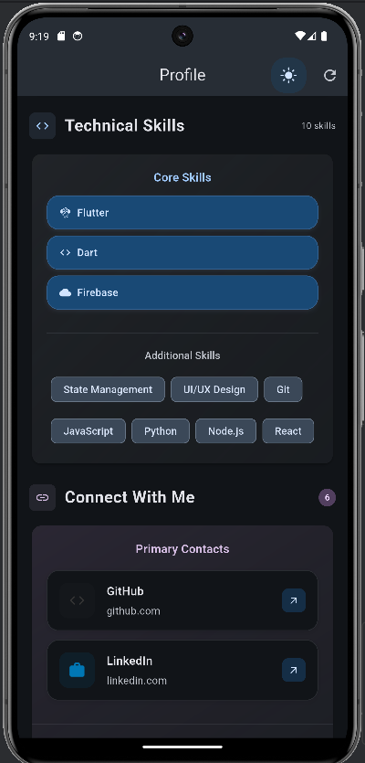
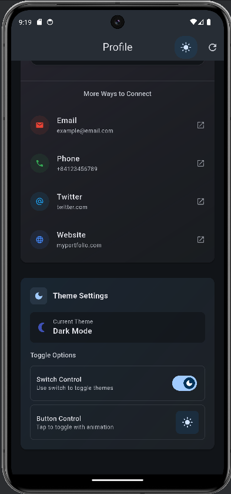

# Profile App - Flutter

Một ứng dụng hồ sơ cá nhân hiện đại được xây dựng bằng Flutter với Provider State Management, tích hợp thiết kế responsive và các tính năng nâng cao cho việc hiển thị thông tin cá nhân, kỹ năng và liên kết xã hội.

### Screenshots

#### Light mode




#### Dark mode




## Chức năng chính

- **Hiển thị hồ sơ cá nhân** với avatar được tạo tự động từ tên
- **Quản lý kỹ năng** hiển thị dưới dạng core skills và additional skills
- **Liên kết xã hội** với layout featured và compact
- **Chuyển đổi theme** Dark/Light mode với nhiều tùy chọn toggle
- **Thiết kế responsive** tự động thích ứng mobile, tablet, desktop

## Công nghệ & Kỹ thuật

### **Framework & Language**
- **Flutter** - Cross-platform development framework
- **Dart** - Programming language
- **Material Design 3** - Modern Google design system

### **State Management**
- **Provider** - State management solution
- **ChangeNotifier** - Observable pattern implementation
- **Consumer** - Widget để listen state changes
- **MultiProvider** - Multiple providers management

### **UI Components**
- **Column** - Main layout structure theo yêu cầu
- **ListTile** - Social links display theo yêu cầu
- **CircleAvatar** - Profile pictures với generated avatars theo yêu cầu
- **Card** - Content containers cho tất cả sections theo yêu cầu
- **AppBar** - Navigation với reload button theo yêu cầu

### **Architecture**
- **Model-View-Provider (MVP)** pattern
- **Separation of Concerns** - Models, Providers, Screens, Widgets, Utils
- **Component-based** - Reusable widgets
- **Clean Code** principles với constants và helpers

## Cài đặt và Chạy

### **Yêu cầu hệ thống**
- Flutter SDK (3.0 hoặc mới hơn)
- Dart SDK (3.0 hoặc mới hơn)
- Android Studio / VS Code
- Android Emulator hoặc thiết bị Android
- Web browser (Chrome/Edge) cho web development

### **1. Clone repository**
```bash
cd profile_app
```

### **2. Cài đặt dependencies**
```bash
flutter pub get
```

### **3. Kiểm tra code quality**
```bash
# Analyze code (should show "No issues found!")
flutter analyze

# Run tests
flutter test
```

### **4. Chạy ứng dụng**

#### **Trên Android Emulator:**
```bash
# Khởi động emulator
flutter emulators --launch <emulator_id>

# Chạy app với debug mode
flutter run --debug
```

#### **Trên Web Browser:**
```bash
flutter run -d chrome
```

#### **Build cho production:**
```bash
# Android APK
flutter build apk --release

# Web
flutter build web --release

# iOS (trên macOS)
flutter build ios --release
```

### **5. Development workflow**
```bash
# Chạy với hot reload
flutter run

# Trong terminal flutter run:
# r - Hot reload
# R - Hot restart
# q - Quit

# Performance monitoring
flutter run --debug --trace-skia
```