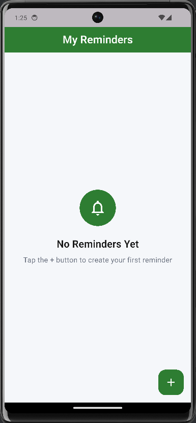
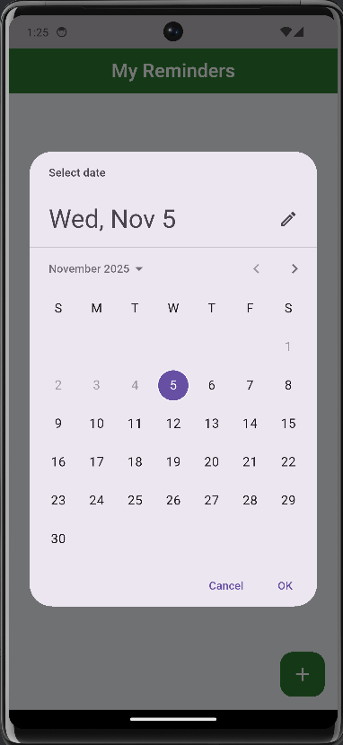
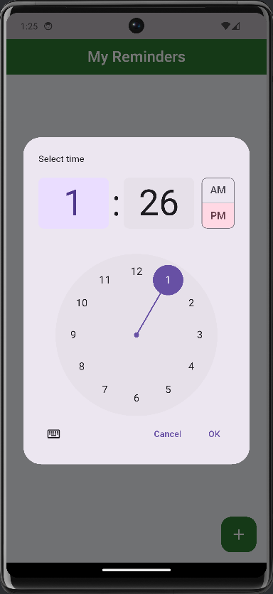
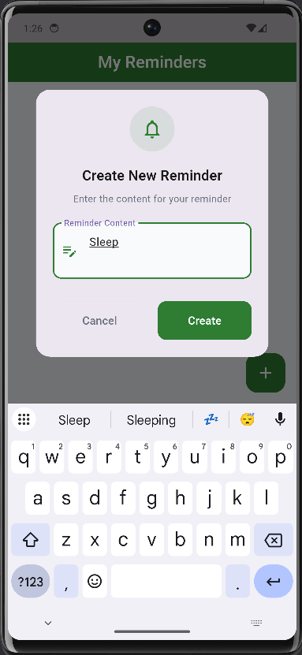
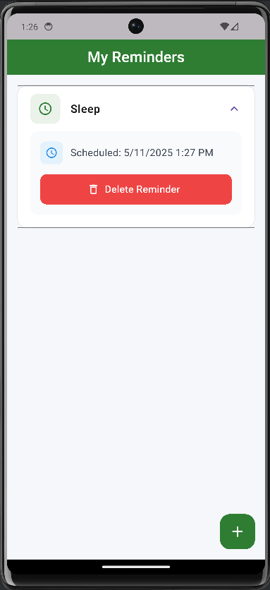

# Reminder App - Flutter

Một ứng dụng lời nhắc hiện đại và đơn giản được xây dựng bằng Flutter với hệ thống thông báo dựa trên Timer, giao diện Material Design.

## Demo

### Screenshots

#### Main Interface




#### Reminder Management  




## Chức năng chính

- **Tạo lời nhắc mới** với nội dung tùy chỉnh và thời gian cụ thể
- **Chọn ngày và giờ** linh hoạt thông qua DatePicker và TimePicker
- **Thông báo đúng giờ** sử dụng hệ thống Timer đáng tin cậy
- **Xem danh sách lời nhắc** với giao diện ExpansionTile trực quan
- **Xóa lời nhắc** dễ dàng với xác nhận

## Công nghệ & Kỹ thuật

### **Framework & Language**
- **Flutter** - Cross-platform development framework
- **Dart** - Programming language
- **Material Design** - Google design system

### **Notification System**
- **flutter_local_notifications** - Local notification plugin
- **Timer** - Dart async timer for scheduling
- **AndroidNotificationChannel** - Android notification setup
- **NotificationDetails** - Cross-platform notification configuration

### **Date & Time Handling**
- **DateTime** - Core Dart date/time operations
- **TimeOfDay** - Flutter time picker integration
- **timezone** - Timezone handling support
- **flutter_timezone** - Device timezone detection

### **UI Components**
- **ExpansionTile** - Expandable reminder cards
- **Container** - Layout và styling containers
- **ListView** - Scrollable reminder list
- **FloatingActionButton** - Add reminder action
- **Dialog** - Custom styled dialogs
- **TextField/TextFormField** - Input với validation
- **DatePicker/TimePicker** - Date và time selection
- **ElevatedButton/TextButton** - Action buttons

### **Utilities & Helpers**
- **Form Validation** - Input validation logic
- **Timer Management** - Active timer tracking với Map
- **Permission Handling** - Android notification permissions

## Cài đặt và Chạy

### **Yêu cầu hệ thống**
- Flutter SDK (3.9.2 hoặc mới hơn)
- Dart SDK (3.9.2 hoặc mới hơn)
- Android Studio / VS Code

### **1. Navigate to project**
```bash
cd reminder_app
```

### **2. Cài đặt dependencies**
```bash
flutter pub get
```

### **3. Kiểm tra permissions (Android)**
Đảm bảo file `android/app/src/main/AndroidManifest.xml` có các permissions:
```xml
<uses-permission android:name="android.permission.RECEIVE_BOOT_COMPLETED"/>
<uses-permission android:name="android.permission.VIBRATE" />
<uses-permission android:name="android.permission.USE_EXACT_ALARM" />
```

### **4. Kiểm tra code quality**
```bash
# Analyze code
flutter analyze

# Run tests
flutter test
```

### **5. Chạy ứng dụng**

#### **Trên Android Emulator:**
```bash
# Khởi động emulator
flutter emulators --launch <emulator_id>

# Chạy app với debug mode
flutter run --debug
```

#### **Trên Web Browser:**
```bash
flutter run -d chrome
```

#### **Build cho production:**
```bash
# Android APK
flutter build apk --release

# Web
flutter build web --release

# iOS (trên macOS)
flutter build ios --release
```

### **6. Development workflow**
```bash
# Chạy với hot reload
flutter run

# Trong terminal flutter run:
# r - Hot reload
# R - Hot restart
# q - Quit
```