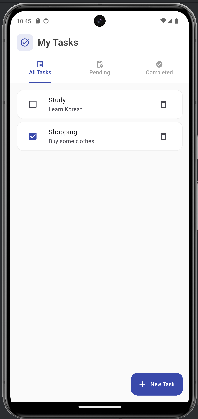
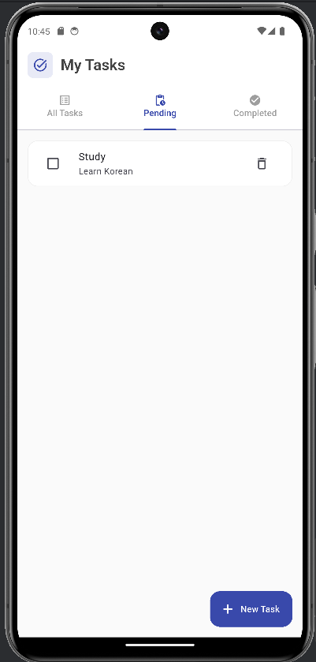
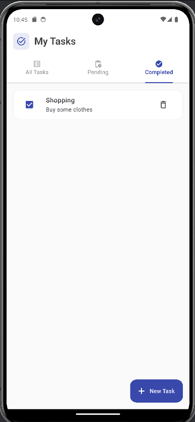

# Todo App - Flutter

Một ứng dụng quản lý công việc (Todo) được xây dựng bằng Flutter với Clean Architecture, cho phép người dùng tạo, quản lý và theo dõi các nhiệm vụ hàng ngày một cách hiệu quả.

### Screenshots






## Chức năng chính

- **Tạo nhiệm vụ mới** với tiêu đề và mô tả
- **Đánh dấu hoàn thành** các nhiệm vụ
- **Xóa nhiệm vụ** không cần thiết
- **Phân loại nhiệm vụ** theo trạng thái (All, Pending, Completed)
- **Lưu trữ dữ liệu** cục bộ với SharedPreferences

## Công nghệ & Kỹ thuật

### **Framework & Language**
- **Flutter** - Cross-platform development framework
- **Dart** - Programming language

### **State Management**
- **StatefulWidget** - Local state management
- **setState()** - Simple state updates
- **Custom State Classes** - Immutable state objects

### **Data Storage**
- **SharedPreferences** - Local data persistence
- **JSON Serialization** - Data conversion

### **UI Components**
- **Material Design 3** - Modern design system
- **TabBar & TabBarView** - Navigation between task categories
- **ListView.builder** - Efficient scrollable list with lazy loading
- **Card & ListTile** - Clean task display
- **FloatingActionButton** - Quick task creation
- **AlertDialog** - Task creation interface
- **Checkbox** - Task completion toggle

## Cài đặt và Chạy

### **Yêu cầu hệ thống**
- Flutter SDK (3.9.2 hoặc mới hơn)
- Dart SDK
- Android Studio / VS Code

### **1. Clone repository**
```bash
cd todo_app
```

### **2. Cài đặt dependencies**
```bash
flutter pub get
```

### **3. Chạy ứng dụng**

#### **Trên Android Emulator:**
```bash
# Khởi động emulator
flutter emulators --launch <emulator_id>

# Chạy app
flutter run
```

#### **Trên Web Browser:**
```bash
flutter run -d chrome
```

#### **Build cho production:**
```bash
# Android APK
flutter build apk

# Web
flutter build web

# iOS (trên macOS)
flutter build ios
```

### **4. Development workflow**
```bash
# Chạy với hot reload
flutter run

# Trong terminal flutter run:
# r - Hot reload
# R - Hot restart  
# q - Quit

# Kiểm tra lỗi
flutter analyze

# Chạy tests
flutter test
```